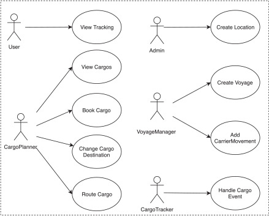
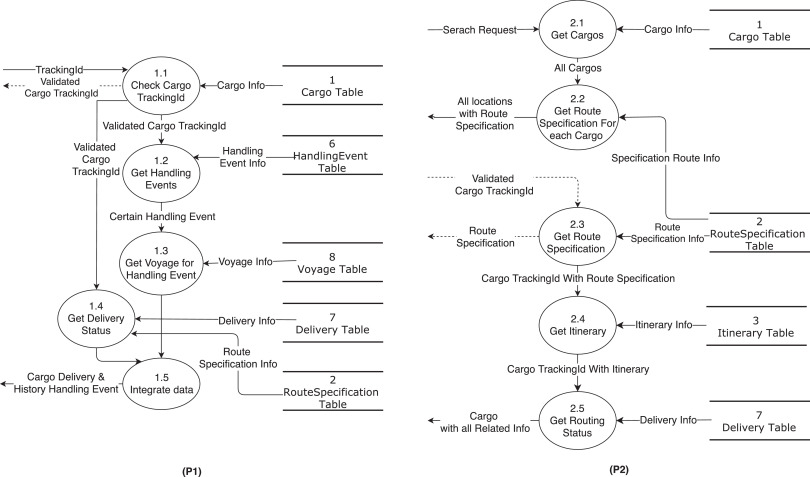
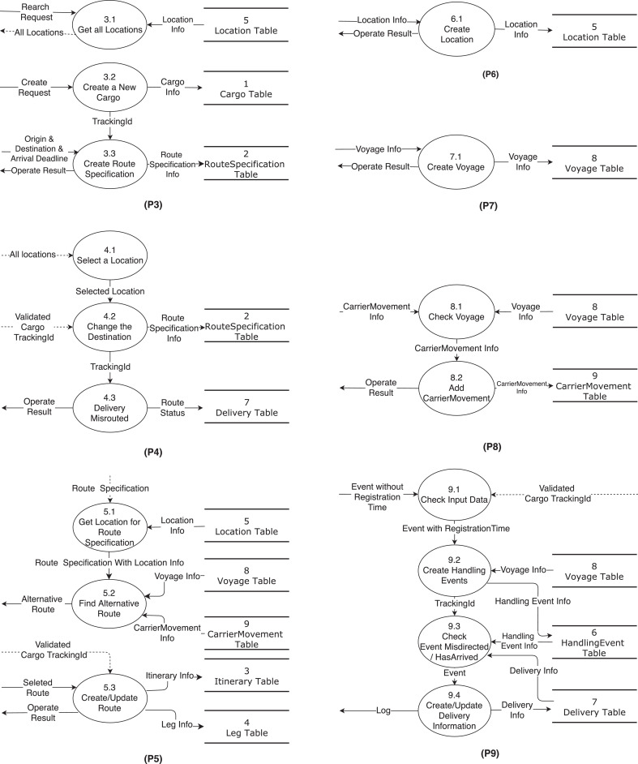

# Cargo Tracking System

## 1. Original Requirement

### 用例图

1.  Users view tracking information.
2. CargoPlanners view cargos’ information and manage cargos, for example *Book Cargo*.
3. CargoTrackers track the progress of each Cargos itinerary through *Handle Cargo Event*.
4. VoyageManagers manage the voyages through *Create Voyage* and *Add CarrierMovement*
5. Admins are responsible for *Create Location*.



### Data Stores

| No.  | Data stores        | Explanation                                                  |
| :--- | :----------------- | :----------------------------------------------------------- |
| 1    | Cargo              | Storing the unique identifier of cargos (***TrackingId***).  |
| 2    | RouteSpecification | Storing the expected itinerary information of cargos, e.g., ***Origin, Destination***, and ***arrivalDeadline***. |
| 3    | Itinerary          | Storing the unique identifier of a cargo’s expected route (***ieneraryNumber***). |
| 4    | Leg                | Storing information related to every step in Itinerary, such as loading location (***loadLocation***), unloading location (***unloadLocation***), loading time (***loadTime***), and unloading time (***unloadTime***). |
| 5    | Location           | Storing information about locations, e.g., the unique identifier ***unLocode*** and the name (***name***) of a location. |
| 6    | HandlingEvent      | Storing information about the historical operation events of cargos, such as **operation type** (*upload* etc.), **location** (*location*), completion time (**completionTime**), registration time (***registrationTime***). |
| 7    | Delivery           | Storing the information related to the current delivery status of cargos, including **transport status**, *misdirected* or not, unloaded (***isUnloadedAtDestination***), estimated arrival time (***estimatedArrivalDate***), route status (***routingStatus***). |
| 8    | Voyage             | Storing the unique identifier of voyages (***voyageNumber***). |
| 9    | CarrierMovement    | Storing voyages’ information such as ***departureLocation,arrivalLocation, departureTime* and *arrivalTime*** |

### The interaction between coarse-grained operations and specific data stores in Cargo Tracking system.

| Use cases                | Explanation                                                  |
| :----------------------- | :----------------------------------------------------------- |
| View Tracking            | Users can view all cargos’ tracking information based on the inputted *Cargo.trackingId*, including the route planning information in *RouteSpecification*, the voyage information in *Voyage*, the hand-off event information in *HandlingEvent*, the delivery information in *Delivery*, etc. |
| View Cargos              | Cargo planners can view all cargos’ information, which includes the route information in *RouteSpecification*, the delivery information in *Delivery*, the voyage planning information in *Itinerary*, etc. |
| Book Cargo               | Cargo planners can book cargos, in which the generated *Cargo.trackingId* and location information are written into *RouteSpecification* and *Location* respectively. |
| Change Cargo Destination | Cargo planners can change a cargo’s destination through modifying *RouteSpecification* based on the *Cargo.trackingId* and the new destination input. Meanwhile, it writes the route status in *Delivery*. |
| Route Cargo              | Cargo planners can arrange transportation routes for a cargo. The arrangement of transportation routes is based on the cargo’s route planning information from *RouteSpecification*, the voyage planning information from *Itinerary*, the *Leg*, and the specific voyage information from *Voyage* and *CarrierMovement*. |
| Create Location          | Admins can add new location into *Location*.                 |
| Create Voyage            | Voyage managers can add new voyage into *Voyage*.            |
| Add CarrierMovement      | Voyage managers can also add the docking information into *CarrierMovement*. Each *CarrierMovement* includes the information of one docking, i.e. docking location and arrival time. Each voyage may contain one or more CarrierMovements. |
| Handle Cargo Event       | Cargo trackers can track the progress of each cargo’s itinerary through *HandlingEvent* and *Delivery*. |

### DFDs





```
Contract ViewTrackingService::getCargoInfo(trackingID : String) : String {

		definition:
			cargo:Cargo = Cargo.allInstance()->any(cargo:Cargo | cargo.TrackingID = trackingID)

		precondition:
			cargo.oclIsUndefined() = false

		postcondition:
			CurrentCargoInfo = cargo.Info and
			if
				(cargo.Goal.oclIsUndefined() = false)
			then
				CurrentCargoInfo = CurrentCargoInfo + cargo.Goal
			endif and
			if
				(cargo.DeliveryHistory.oclIsUndefined() = false)
			then
				CurrentCargoInfo = CurrentCargoInfo + cargo.DeliveryHistory
			endif and
			result = CurrentCargoInfo
	}
```


```
Contract ProcessSaleService::makeNewSale() : Boolean {

		/*
		 * Generated by RM2DOc - Precondition
		 * CurrentCashDesk exists
		 * The attribute IsOpened of the object CurrentCashDesk is equal to true
		 * (CurrentSale doesn't exist, or (CurrentSale exists, and the attribute IsComplete of the object CurrentSale is equal to true))
		 */
		precondition:
			CurrentCashDesk.oclIsUndefined() = false and
			CurrentCashDesk.IsOpened = true and
			(CurrentSale.oclIsUndefined() = true or
				(CurrentSale.oclIsUndefined() = false and
					CurrentSale.IsComplete = true
				)
			)

		/*
		 * Generated by RM2DOc - Postcondition
		 * s represented the object of class Sale
		 * The object s was created
		 * The object s was linked to the object CurrentCashDesk by BelongedCashDesk
		 * The object CurrentCashDesk was linked to the object s by ContainedSales
		 * The attribute IsComplete of the object s became false
		 * The attribute IsReadytoPay of the object s became false
		 * The object s was put into the instance set of class Sale
		 * The object CurrentSale became s
		 * The return value was true
		 */
		postcondition:
			let s:Sale in
			s.oclIsNew() and
			s.BelongedCashDesk = CurrentCashDesk and
			CurrentCashDesk.ContainedSales->includes(s) and
			s.IsComplete = false and
			s.IsReadytoPay = false and
			Sale.allInstance()->includes(s) and
			self.CurrentSale = s and
			result = true

	}
```


```
	Contract ProcessSaleService::endSale() : Real {

		/*
		 * Generated by RM2DOc - Definition
		 * sls is the Set of class SalesLineItem, including  which CurrentSale is linked to
		 * sub is the Set of Real, including the Subamount of each object in the set sls
		 */
		definition:
			sls:Set(SalesLineItem) = CurrentSale.ContainedSalesLine,
			sub:Set(Real) = sls->collect(s:SalesLineItem | s.Subamount)

		/*
		 * Generated by RM2DOc - Precondition
		 * CurrentSale exists
		 * The attribute IsComplete of the object CurrentSale is equal to false
		 * The attribute IsReadytoPay of the object CurrentSale is equal to false
		 */
		precondition:
			CurrentSale.oclIsUndefined() = false and
			CurrentSale.IsComplete = false and
			CurrentSale.IsReadytoPay = false

		/*
		 * Generated by RM2DOc - Postcondition
		 * The attribute Amount of the object CurrentSale became the sum of sub
		 * The attribute IsReadytoPay of the object CurrentSale became true
		 * The return value was the attribute Amount of the object CurrentSale
		 */
		postcondition:
			CurrentSale.Amount = sub.sum() and
			CurrentSale.IsReadytoPay = true and
			result = CurrentSale.Amount

	}
```


## RequirementsModel

### 1. Conceptual Class Diagram

